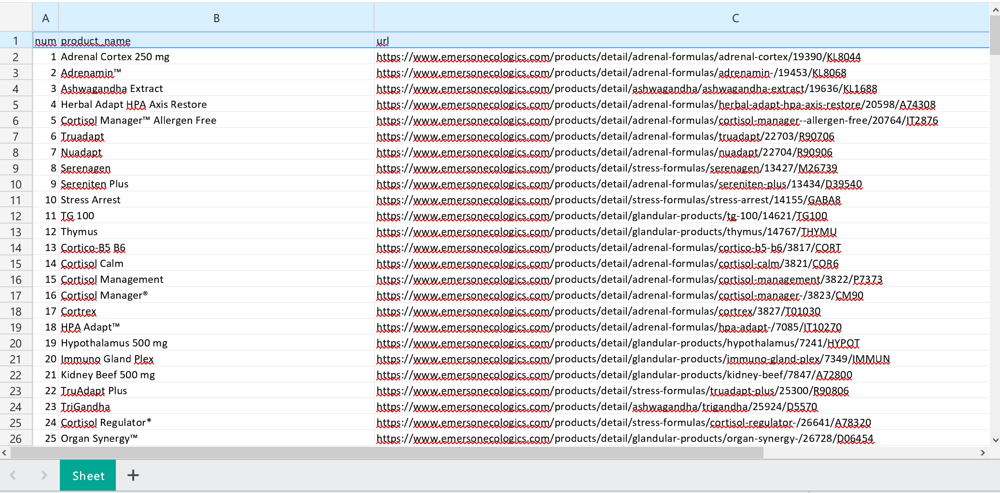

# Webparser of emerson ecologics website
___

This script located in `main.py` is designed to gather data from
https://www.emersonecologics.com/.

Script gets data of each product (product name, url) from each website page.

___
## Core stack

:heavy_check_mark: selenium==4.6.0

___
## Installation

First you need to create a virtual environment with the following command:

`python -m venv env`

After activating the virtual environment, use the command below to install the required dependencies:

`pip install -r requirements.txt`

The `requirements.txt` file is located at the root of the project.

___